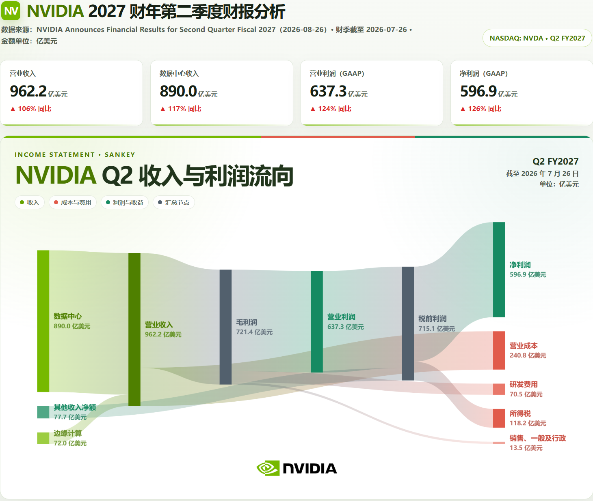
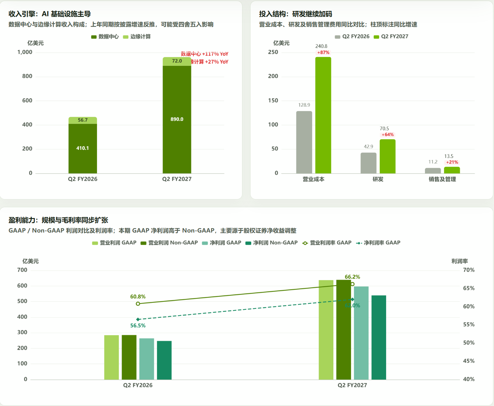
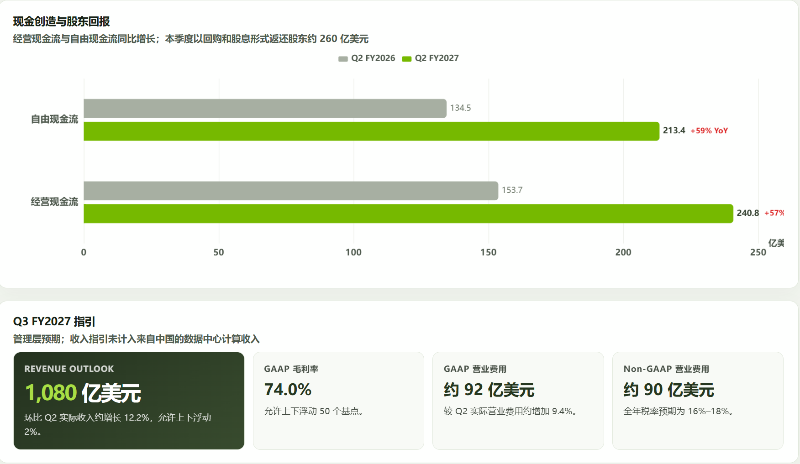
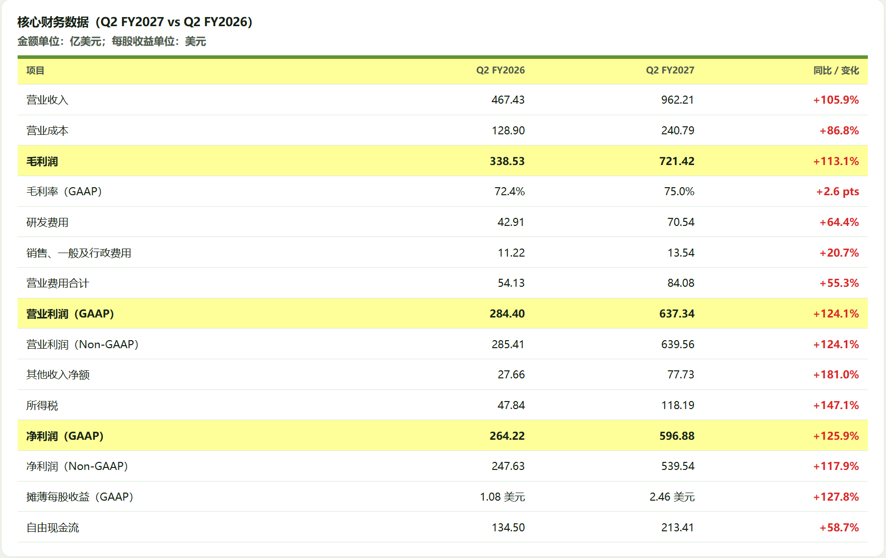

# Financial Report Dashboard

一个的财报可视化 Skill：从上市公司财报 PDF、业绩新闻稿或财务表格中提取数据，生成可审计、可离线运行、适配桌面与移动端的中文 ECharts 看板。


## 主要能力

- 提炼营业收入、营业利润、净利润等核心 KPI
- 用桑基图展示收入、成本、费用与利润流向
- 对比业务收入构成、费用结构和现金流
- 同时呈现 GAAP / Non-GAAP 利润及利润率
- 展示管理层下一季度指引
- 自动遵循“红涨绿跌”的中文财务图表习惯
- 校验财务勾稽关系、单位换算和同比计算
- 使用本地 ECharts，无需 CDN 或前端构建工具
- 支持桌面端、移动端及宽桑基图横向滚动
- 使用更易读的正文、图例、坐标轴、数据标签与表格字号层级
- 在桑基图留白区加入本地官方公司 Logo，并验证透明背景与移动端定位

## 项目结构

```text
financial-report-dashboard/
├── SKILL.md                         # Codex Skill 入口与执行规范
├── agents/
│   └── openai.yaml                  # Codex UI 元数据
├── assets/
│   └── dashboard-template/          # 可直接运行的 ECharts 看板模板
│       ├── index.html
│       ├── app.js
│       ├── echarts.min.js
│       └── company-logo.png         # 桑基图透明 Logo 示例，适配时必须替换
├── references/
│   ├── dashboard-adaptation.md      # 数据口径、颜色和验收规则
│   └── visual-polish.md             # 字体、桑基图标签与透明 Logo 规范
├── scripts/
│   └── scaffold_dashboard.py        # 安全复制模板的脚手架
├── CONTRIBUTING.md
├── THIRD_PARTY_NOTICES.md
└── LICENSE
```

## 安装

### Codex

将仓库克隆到 Codex 的个人技能目录：

```bash
git clone <your-repository-url> "${CODEX_HOME:-$HOME/.codex}/skills/financial-report-dashboard"
```

也可以先下载仓库，再复制整个目录：

```bash
cp -R financial-report-dashboard "${CODEX_HOME:-$HOME/.codex}/skills/"
```

重新开启 Codex 会话后，即可通过 `$financial-report-dashboard` 显式调用；符合描述的财报可视化任务也可以自动触发该 Skill。

### Claude Code

将仓库克隆到 Claude Code 的个人技能目录，即可在所有项目中使用：

```bash
mkdir -p "$HOME/.claude/skills"
git clone <your-repository-url> "$HOME/.claude/skills/financial-report-dashboard"
```

如果已经下载了仓库，也可以直接复制：

```bash
mkdir -p "$HOME/.claude/skills"
cp -R financial-report-dashboard "$HOME/.claude/skills/"
```

如需仅在当前项目中启用，可安装到项目级技能目录并提交给团队共享：

```bash
mkdir -p .claude/skills
cp -R financial-report-dashboard .claude/skills/
```

安装后可在 Claude Code 中通过 `/financial-report-dashboard` 显式调用；符合 Skill 描述的任务也可以自动触发。如果安装前不存在 `.claude/skills` 目录，请重启 Claude Code 以确保完成发现。更多说明见 [Claude Code Skills 官方文档](https://code.claude.com/docs/en/slash-commands)。

## 使用示例

```text
使用 $financial-report-dashboard，根据 ./reports/company-q2.pdf，
在 ./output/company-q2 目录创建中文财报可视化。
金额统一使用亿元，数据颜色采用红涨绿跌。
```

也可以直接创建模板副本：

```bash
python3 scripts/scaffold_dashboard.py ./output/company-q2
```

脚手架不会覆盖非空目录。生成的模板包含 NVIDIA 示例数据与 Logo，必须根据目标财报完整替换公司、品牌素材、财期、单位、指标、指引和注释。

### Skill 使用案例：NVIDIA FY2027 Q2 财报可视化

以下案例展示了使用本 Skill 生成的 NVIDIA 2027 财年第二季度中文财报看板，涵盖核心 KPI、收入与利润流向、业务与费用对比、盈利能力、现金流、业绩指引及详细财务数据。

<table>
  <tr>
    <td width="50%" align="center">
      <a href="docs/nvidia_01.png"></a><br>
      <sub><b>核心 KPI 与收入利润桑基图</b></sub>
    </td>
    <td width="50%" align="center">
      <a href="docs/nvidia_02.png"></a><br>
      <sub><b>收入结构、投入结构与盈利能力</b></sub>
    </td>
  </tr>
  <tr>
    <td width="50%" align="center">
      <a href="docs/nvidia_03.png"></a><br>
      <sub><b>现金流与下一季度业绩指引</b></sub>
    </td>
    <td width="50%" align="center">
      <a href="docs/nvidia_04.png"></a><br>
      <sub><b>核心财务数据明细与同比变化</b></sub>
    </td>
  </tr>
</table>

## 推荐工作流

1. 读取财报 PDF，确认财期、币种、原始数据单位及比较期间。
2. 使用脚手架创建离线页面。
3. 将金额统一换算为目标单位，再写入 `app.js`，不能只修改单位文字。
4. 根据财报科目调整 KPI、桑基图节点、对比图和数据表。
5. 核对 GAAP / Non-GAAP 口径与衔接关系。
6. 运行语法、勾稽和浏览器截图检查。
7. 搜索并清除 NVIDIA 示例名称、日期和数字。

完整规则见 [dashboard-adaptation.md](references/dashboard-adaptation.md) 与 [visual-polish.md](references/visual-polish.md)。

## 数据与视觉约定

- 同比或环比上涨使用红色 `#dc2626`
- 同比或环比下跌使用绿色 `#168a62`
- 公司品牌色用于品牌识别及类别区分，不代表涨跌
- 推导值必须在图表说明或页脚中注明
- 桑基图的收入、成本、毛利、营业利润、税前利润和净利润应满足财务勾稽
- 每股收益保留“货币/股”单位，不随金额单位一起缩放

## 本地验证

项目本身没有 npm 依赖。需要 Python 3；Node.js、`pdftotext` 和无头浏览器用于增强验证。

```bash
node --check assets/dashboard-template/app.js
python3 scripts/scaffold_dashboard.py /tmp/financial-dashboard-example
```

用浏览器直接打开生成目录中的 `index.html` 即可预览。提交模板修改前，建议分别以约 1440px 和 390px 宽度检查桌面与移动布局。

## 适用范围

该 Skill 面向上市公司季度或年度业绩可视化，不适用于通用 BI 看板、实时行情终端或自动投资决策。输出内容仅用于财务信息展示，不构成投资建议。

## 贡献

欢迎提交 Issue 和 Pull Request。修改前请阅读 [CONTRIBUTING.md](CONTRIBUTING.md)。

## 许可证

本项目采用 [MIT License](LICENSE)。内置 Apache ECharts 的许可信息见 [THIRD_PARTY_NOTICES.md](THIRD_PARTY_NOTICES.md)。模板中展示的公司名称和商标仅用于演示，其权利归各自权利人所有。
